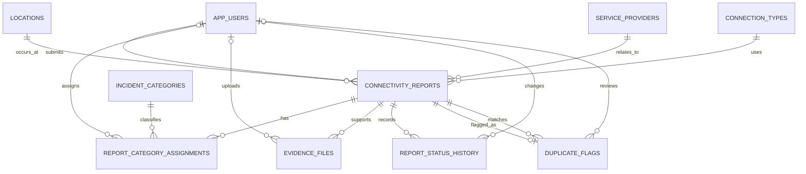

# ACS 261 Group Assignment

## Citizen-Generated Internet Connectivity Tracker

**Community:** Daystar University students  
**Proposed users of the evidence:** Daystar ICT Directorate, Student Affairs, and relevant network providers  
**Data period in the prototype:** continuous collection; dashboard example uses fictional data from  June 2026

## 1. Problem statement

Reliable internet access is essential for accessing the learning management system, submitting assignments, downloading readings, joining online classes, communicating with lecturers, and conducting research. Yet students may experience recurring connectivity failures in particular buildings and at particular times: complete Wi-Fi outages, intermittent disconnections, slow speeds, weak signal, or failure at the login/captive portal. These incidents are normally shared in WhatsApp groups or reported one by one to the help desk. That produces complaints, but not a reliable picture of where the network fails, how often it fails, and whether fixes last.

The people most directly affected are students using the campus network and, secondarily, lecturers and staff trying to run technology-supported learning. A failure at a deadline or during a live class can cause missed submissions, extra mobile-data costs, lost study time, and unequal access for students who cannot afford an alternative connection. For the university, unresolved failures reduce service quality and make it difficult for ICT to prioritise scarce maintenance resources or demonstrate that action was taken.

Structured citizen-generated data is needed because the important evidence is currently scattered and anecdotal. A standard report that records time, location, network type, provider, category, severity, and optional speed measurement can reveal repeating patterns. Aggregated reports will help decision-makers identify hotspots, investigate root causes, schedule maintenance, and measure whether interventions improve the student experience.

## 2. Stakeholder analysis

| Stakeholder | Role in the system | Motivation / use of data |
|---|---|---|
| Students | Submit reports, optionally attach a screenshot or speed test. | Faster, fairer resolution of repeated problems; anonymous reporting protects students who prefer not to identify themselves. |
| Student leaders / class representatives | Encourage responsible reporting and communicate aggregated findings. | Evidence for constructive engagement with university management. |
| ICT help desk and network administrators | Review, categorise, investigate, update status, and resolve reports. | A location- and time-based queue for prioritising technical work. |
| Student Affairs and university management | Receive semester summaries and monitor service commitments. | Evidence for resource allocation, vendor oversight, and student-welfare decisions. |
| Mobile/network providers | Receive an aggregated escalation where their network is implicated. | Information about repeated coverage or service issues in a defined area. |
| All students and lecturers | Benefit from more reliable internet and transparent aggregate progress. | Improved teaching, learning, and access to online services. |

## 3. Citizen-generated data design

### Collection process

Students submit a short mobile-friendly web form. A student may sign in with a university email or choose anonymous reporting; anonymous reports do not store an email or name. A moderated entry option allows a help-desk officer to enter a report received in person or via USSD. The public form uses plain language and is designed to take less than two minutes.

Before submitting, the student sees a consent statement: *“I agree that this report may be used only in aggregated, de-identified form to improve connectivity services.”* Consent is mandatory, while an optional screenshot/speed-test image is not.

### Exact form fields

| Field | Type / permitted values | Required? |
|---|---|---|
| Reporting mode | Identified or anonymous | Yes |
| Campus, building, and area | Selected from approved location list | Yes |
| Connection type | Campus Wi-Fi, mobile data, Ethernet | Yes |
| Provider | Daystar ICT, Safaricom, Airtel, Telkom, other/unknown | Recommended; may be unknown |
| Problem began | Date and time | Yes |
| Problem category | Complete outage; intermittent connection; slow connection; login/captive-portal failure; weak/no coverage | Yes; one or more permitted |
| Severity | Low, medium, high, critical | Yes |
| Description | Up to 1,000 characters; no names or sensitive content | Yes |
| Download speed / latency | Number in Mbps / ms from a speed test | Optional |
| Evidence | Screenshot, photo, document, or speed-test result up to 10 MB | Optional |
| Consent | Consent to de-identified, aggregated use | Yes |

Severity guidance is displayed in the form: low = minor inconvenience; medium = academic work slowed; high = normal academic activity repeatedly interrupted; critical = no usable connection during an urgent learning activity.

### Quality, duplication, and privacy controls

* The form validates required fields, valid dates, numeric ranges, approved locations, and maximum file size. `reported_at` cannot precede the stated outage time.
* A moderator reviews free-text descriptions and evidence for relevance, safety, and inappropriate personal information. Category assignments can be corrected by a moderator.
* The database automatically flags a likely duplicate when the same location, provider, connection type, and a two-hour reporting window match. A moderator confirms or dismisses the flag; the report is never silently deleted.
* Anonymous reports have no user account link. Identified reports are shown only to authorised ICT/moderator roles. Public dashboards show counts and trends only; they do not display names, email addresses, device identifiers, or precise personal movement histories.
* Evidence uses a protected storage key rather than a public filename. Access is role-based, downloads are logged in a real deployment, and the system should retain identifiable account data only for an approved retention period (for example, one semester).

## 4. Database design

### Entity–relationship diagram

### Relational schema

PK = primary key; FK = foreign key. Full executable DDL is in `database/schema.sql`.

| Table | Key fields and main attributes |
|---|---|
| `app_users` | **user_id PK** BIGINT; university_email UNIQUE; display_name; user_role; is_active; created_at |
| `locations` | **location_id PK** INT; campus_name; building_name; area_name; latitude; longitude; UNIQUE(campus_name, building_name, area_name) |
| `service_providers` | **provider_id PK** SMALLINT; provider_name UNIQUE; provider_type; contact_channel |
| `connection_types` | **connection_type_id PK** TINYINT; connection_name UNIQUE |
| `incident_categories` | **category_id PK** SMALLINT; category_name UNIQUE; category_description; default_priority |
| `connectivity_reports` | **report_id PK** BIGINT; reporter_id FK nullable; location_id FK; provider_id FK nullable; connection_type_id FK; outage_started_at; reported_at; severity; description; measurements; is_anonymous; consent; status; resolved_at |
| `report_category_assignments` | **(report_id, category_id) PK**; report_id FK; category_id FK; assigned_by FK; assignment_method; assigned_at |
| `evidence_files` | **evidence_id PK** BIGINT; report_id FK; uploaded_by FK; storage_key UNIQUE; file type, size, and moderation status |
| `duplicate_flags` | **duplicate_flag_id PK** BIGINT; flagged_report_id FK UNIQUE; matching_report_id FK; match_score; review state and reviewer |
| `report_status_history` | **status_history_id PK** BIGINT; report_id FK; old/new status; changed_by FK; note; changed_at |

### Normalisation to 3NF

**Unnormalised form (UNF).** An initial spreadsheet could contain one row with student details, location text, provider text, a comma-separated category list, multiple evidence filenames, and repeated status updates. This produces repeating groups and makes updates unreliable.

**First Normal Form (1NF).** Each cell holds one value: one evidence item per `evidence_files` row, one status event per `report_status_history` row, and no comma-separated category list. Each report gets a unique `report_id`.

**Second Normal Form (2NF).** Facts that describe a location, provider, category, or user are moved from the report into their own tables. In the many-to-many category bridge, `assignment_method` depends on the whole composite key `(report_id, category_id)`, not on only one part.

**Third Normal Form (3NF).** Non-key facts depend only on their table’s key. For example, `provider_type` depends on `provider_id`, not on a report; building/area data depends on `location_id`; and a category description depends on `category_id`. The report stores only foreign keys for these facts. Therefore, no transitive dependency such as `report_id → provider_id → provider_type` remains in `connectivity_reports`.

### Referential integrity rules

Reports restrict deletion of a location or connection type, because removing a live reference would destroy the meaning of historical data. Deleting a user sets the reporter/uploader/reviewer FK to `NULL`, retaining de-identified evidence. Deleting a report cascades to category assignments, evidence, duplicate flags, and status history because those records have no independent meaning. Categories are restricted from deletion while assigned; they should be marked inactive instead.

## 5. Functional requirements

| ID | Requirement |
|---|---|
| FR-01 | The system shall allow an identified student to authenticate using a university email and allow an anonymous report without an account. |
| FR-02 | The system shall collect structured connectivity reports with location, time, connection type, category, severity, description, and consent. |
| FR-03 | The system shall accept optional evidence files and validate MIME type and 10 MB size limit. |
| FR-04 | The system shall allow a reporter or moderator to assign one or more incident categories. |
| FR-05 | The system shall track report status from submitted to under review, resolved, rejected, or duplicate, with an audit history. |
| FR-06 | The system shall flag likely duplicates using a location/provider/connection/time matching rule and require moderator review. |
| FR-07 | The system shall provide aggregate dashboards by category, location, urgency, and time. |
| FR-08 | The system shall support weekly and semester reports, including resolution time and trend metrics. |
| FR-09 | The system shall export authorised, de-identified aggregate data to CSV/PDF for stakeholders. |
| FR-10 | The system shall enforce role-based access so students cannot view others’ reports or private evidence. |

## 6. Database implementation

The prototype is implemented for **MySQL 8.0+**. The scripts use InnoDB foreign keys, `NOT NULL`, `UNIQUE`, `CHECK`, and `ENUM` constraints. They include two dashboard views: `vw_dashboard_location_category` and `vw_dashboard_daily_trends`.

The implementation also includes three triggers. The first creates a status-history record on report creation, the second auto-flags a likely duplicate, and the third records any status update. The optional `sp_resolve_report` stored procedure demonstrates a controlled resolution workflow. Twelve SQL queries, covering joins, aggregations, `HAVING`, filtering, subqueries, a self-join, views, and calculations, are in `database/analytics_queries.sql`.

To run the prototype in MySQL Workbench:

1. Run `schema.sql`.
2. Run `seed_data.sql`.
3. Run `analytics_queries.sql` query by query.
4. Use the results of queries Q1–Q6 in a BI tool or compare them with the demonstration dashboard.

## 7. Dashboard and analytics

The accompanying `dashboard/dashboard.html` is a presentation-ready mock-up based on the fictional seed data. It is intentionally labelled as such. In a real deployment, the charts would refresh from Q1–Q6 or the two views.

**Illustrative findings from the seed data (18 submitted records):**

* Intermittent connection is the most common category: 6 of 18 reports (33.3%). Complete outage and slow connection each account for 4 reports (22.2%).
* The Agape Library Library Wing has the most reports (6), followed by the Hope Centre Study Area (5). These are the first locations for technical inspection.
* There are four critical reports, three of which are unique after the confirmed duplicate is considered. The highest-priority pattern is complete Wi-Fi outage in teaching/study spaces.
* Report volume peaks at four reports on both 26 and 28 June. The data period is too short to claim a seasonal pattern; it is sufficient to demonstrate daily monitoring.
* Eight of 18 reports are resolved in the sample. The remaining reports should be triaged by severity and age before the next reporting period.

The data does **not** prove a root cause. It indicates where to investigate. ICT should combine it with access-point logs, bandwidth utilisation, authentication-server logs, and planned maintenance records.

## 8. Policy / decision-support brief

**To: Daystar University ICT Directorate and Student Affairs**

The proposed tracker provides a practical way to convert recurring student connectivity complaints into credible, privacy-conscious evidence. In the prototype data, intermittent failures are the leading problem and the Agape Library and Hope Centre are the most frequently reported locations. Complete outages are fewer but more urgent because they prevent students from accessing learning services altogether.

The immediate operational decision should be to prioritise a one-week technical assessment of these two hotspots: inspect access-point capacity and placement, review authentication and DHCP logs, test throughput at busy hours, and compare availability before and after any corrective work. Critical outages should have a published response target (for example, acknowledgement within 30 minutes during teaching hours), while high-severity intermittent reports should be reviewed daily.

The university should publish a small, de-identified monthly dashboard showing report volume, the top locations/categories, median resolution time, and actions completed. This closes the feedback loop: students can see that reporting has value, ICT can justify maintenance or bandwidth investment, and management can decide whether to fund additional access points, capacity upgrades, vendor escalation, or coverage surveys. The tracker should support decisions, not replace technical monitoring or expose individuals.

## Appendix: submission checklist

| Requirement | Where supplied |
|---|---|
| Problem statement | Section 1 |
| Stakeholder analysis | Section 2 |
| Citizen-generated data design | Section 3 |
| ERD, schema, 3NF, PK/FK rules | Section 4 and `database/schema.sql` |
| Functional requirements | Section 5 |
| DDL, 10+ queries, 2+ views, trigger/procedure | `database/schema.sql` and `database/analytics_queries.sql` |
| Dashboard and findings | Section 7 and `dashboard/dashboard.html` |
| Decision-support brief | Section 8 |
